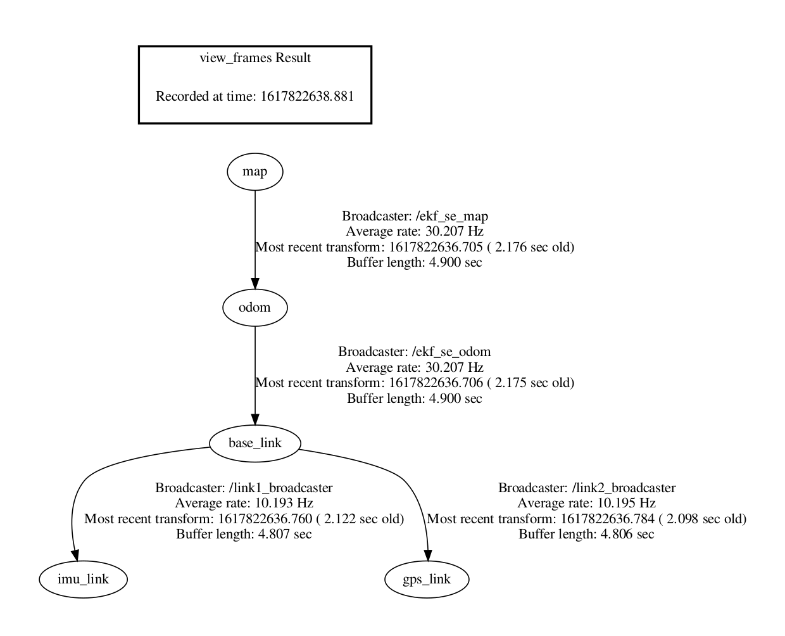

# zeus_description

This package contains everything related to the robot model and TF tree. 

## File structure

#### config
This folder contains all the parameters of the controllers used in the simulation.

### launch
This folder contains the launch files for static transform boradcaster of imu_link to base_link and gps_link to base_link.

#### STL.zip
This zip folder has all the STL files of the robot for the simulation. They need to be unziped in the STL folder to be referenced to in the URDF file.

#### urdf
This folder contains the robot description in urdf.

